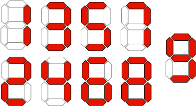
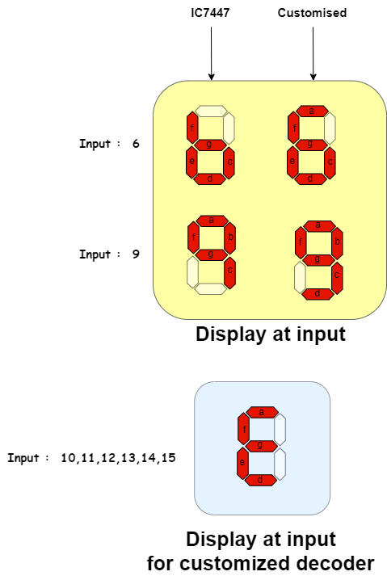
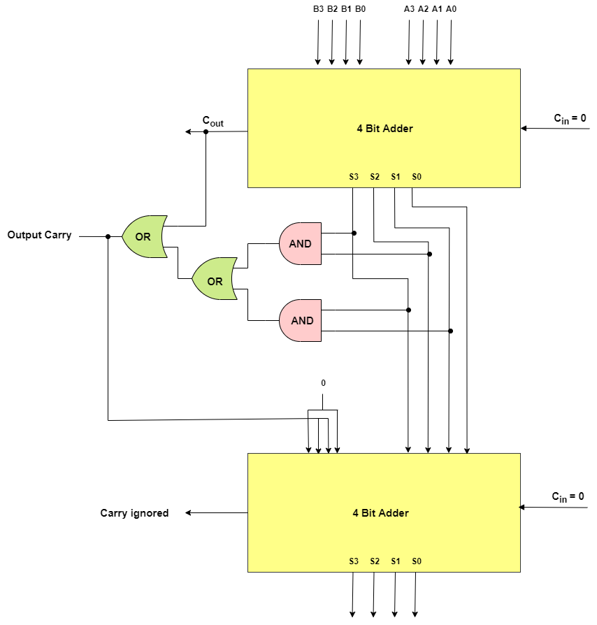
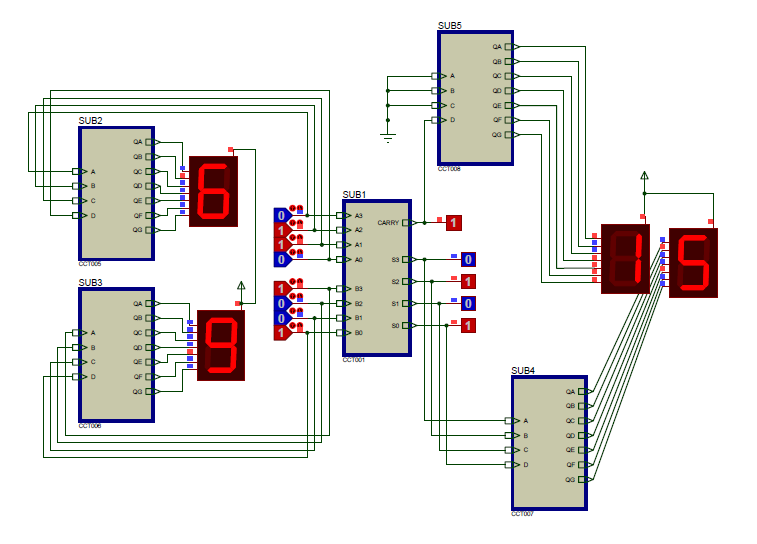

# 4-Bit BCD Adder using 7-Segment Display

We have designed a 4-Bit BCD Adder using the 7-Segment display in Proteus 8.0 Professional.

- It takes the two 4-Bit numbers preferably BCD (0-9) and displays the summation of inputs using 7-Segment Display.

## Components used

- Customized BCD to 7-Segment Display driver
- 4-Bit Full-Adder with Fast Carry and some logic to drive two 7-segment Displays at the output.
- AND, OR, NOR, NOT Gates 
- 7-Segment Displays with common anode
- Logic State Source (Latched Action) at inputs
- Logic State Indicator (Probe) at the Output stage 

##  Why Customized BCD to 7-Segment Display Driver?
We can use the existing IC7447 for BCD to 7-segment Display Driver, it shows a garbage display when the inputs are outside the range of 0-9 so we used a customized module that can drive the 7-segment display and when inputs are outside the range of 0-9 it shows E on Display indicating an error.

## Working Principle
- Before getting into details of the working principle lets see the pin diagram of 7-Segment Display also as we are using common anode display the inverted logic has to be given to the display, so we have included it in the decoder itself.
 
- As we are using customized BCD to 7-Segment Decoder the output looks like the below

- Difference between IC7447 and Designed Decoder 

- Refer [this](Schematics/BCD-to-7-Segment-Decoder.pdf) for schematic.

- Now let us see how the circuit evaluates the summation using Full Adder module with Fast Carry
  
- As the Adder has 5 output pins and the decoder designed is for 4-bit, we need two 7-segment Displays to display the output and the sub-circuit for the above mentioned explanation is attached below

- **The above circuit can be decoded and can be displayed on 7-segment Display**
- Refer [this](Schematics/BCD-Adder-to-Drive-two-7-Segment-Displays.pdf) for schematic.
- Output Carry and S3,S2,S1,S0 are the output pins and can be decoded using the decoder mentioned above.

## Main Circuit

## Demo Video
https://user-images.githubusercontent.com/88726684/177003558-917dc3c1-2c9f-45b4-9f67-33a0c63a7777.mp4

